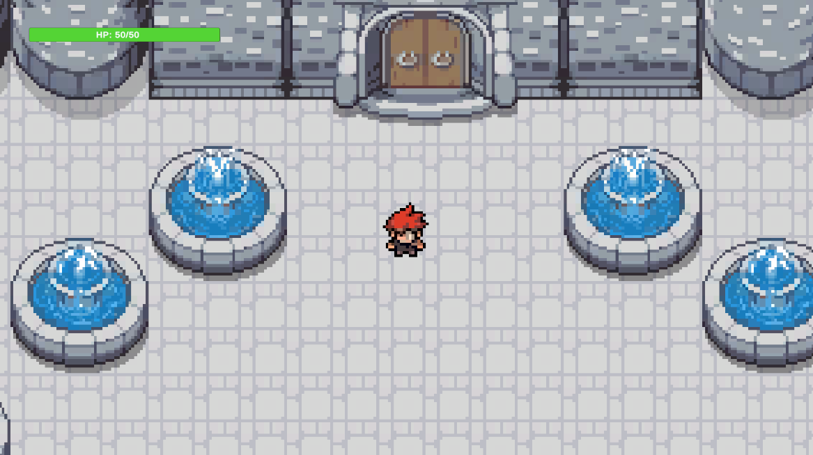
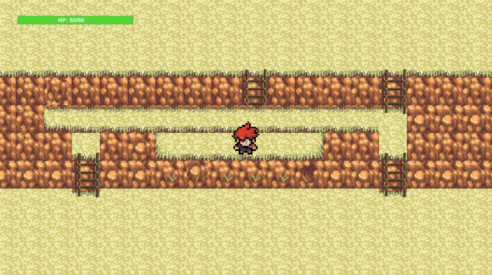
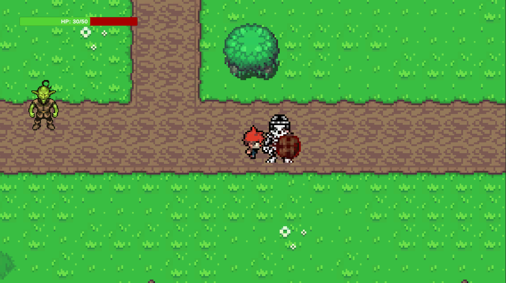
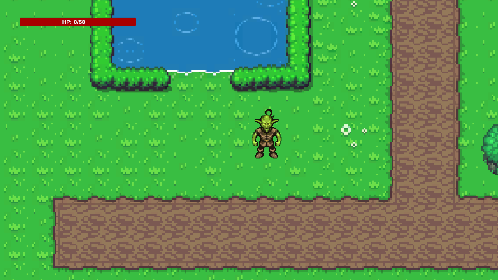

# RPG 2D Game
 Made using Unity. This is a basic RPG Game. 

Enjoy exploring a 2D world! Use the following keys to navigate:

- ↑ (Up Arrow) to move up
- ↓ (Down Arrow) to move down
- ← (Left Arrow) to move left
- → (Right Arrow) to move right

    

        
    

    

        
    

Be careful not to take damage from enemies!

    

        
    

    

        
    

Still a work in progress ATM
## Dev Notes

16/10/23
- Modify the camera transform position after expanding world. Move the camera object to where the world clips and use the coordinates for minPosition(x and y)
and maxPosition(x and y)

17/10/23
- In order to use Prefab drag into scene and set the New Min Position and New Max Position from the position of the camera(X and Y position)

Initial world looked like this. Note no healthbar or enemies:

