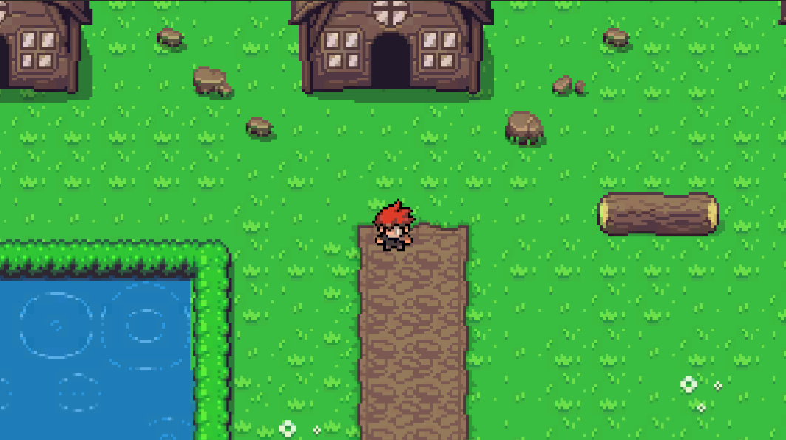

# RPG 2D Game
 Made using Unity. This is a basic RPG Game. 

The world looks like this:

Still a work in progress ATM
## Dev Notes

16/10/23
- Modify the camera transform position after expanding world. Move the camera object to where the world clips and use the coordinates for minPosition(x and y)
and maxPosition(x and y)

17/10/23
- In order to use Prefab drag into scene and set the New Min Position and New Max Position from the position of the camera(X and Y position)